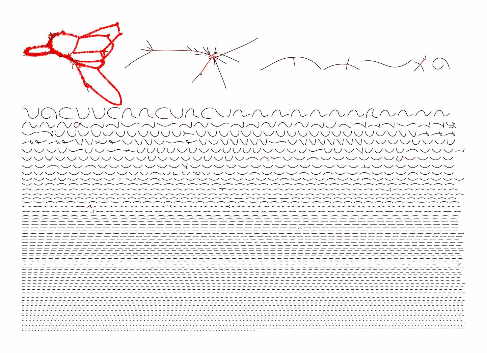
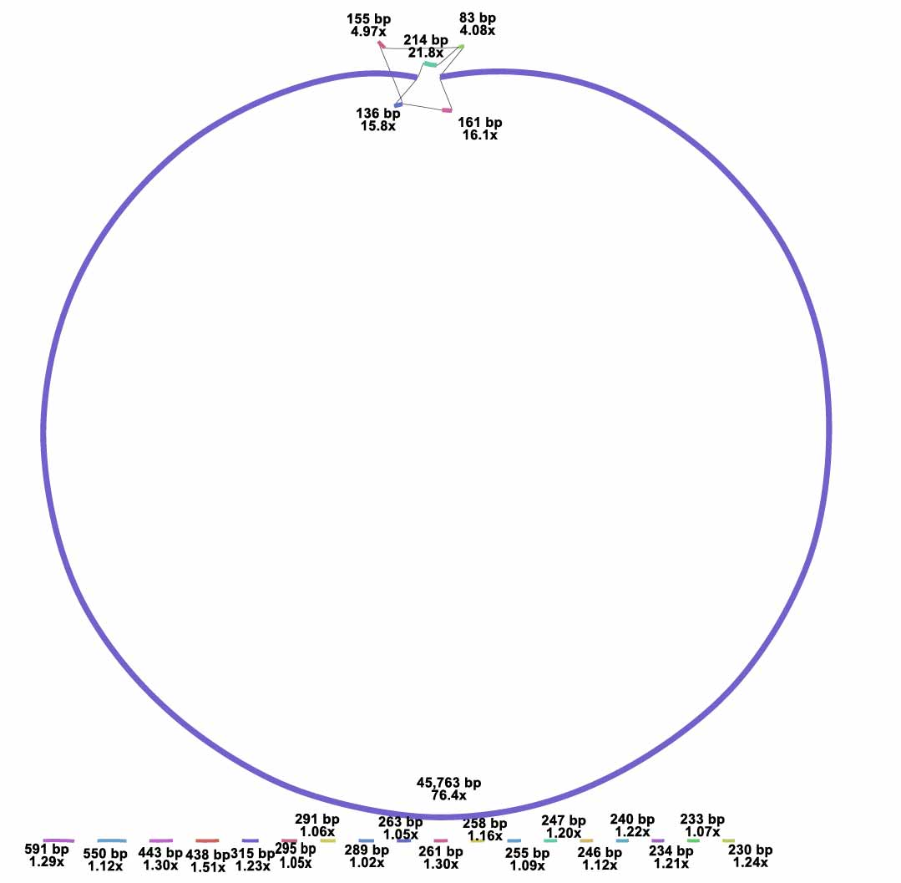

# CF032_PT
Data analysis for CF032 case study

# Assemblies

Using all reads (n=1.3 million):

Using a subsample (n=100,000 reads):

# Bacteria genomes assemblies

1. Get the closest reference genome: 

`cut -f 2 besthit_vs_NT_more900_contigs_DC032_S62.blastn | sort -n | uniq -c | sort -nr`

Make sure that is a "complete genome", that is, not contigs. Then download the complete genome fasta file. In this case:

https://www.ncbi.nlm.nih.gov/nuccore/HE798385.1?report=fasta

2. Get the contigs.fasta file from the assembly folder

3. Use contiguator: 

http://combo.dbe.unifi.it/contiguator

